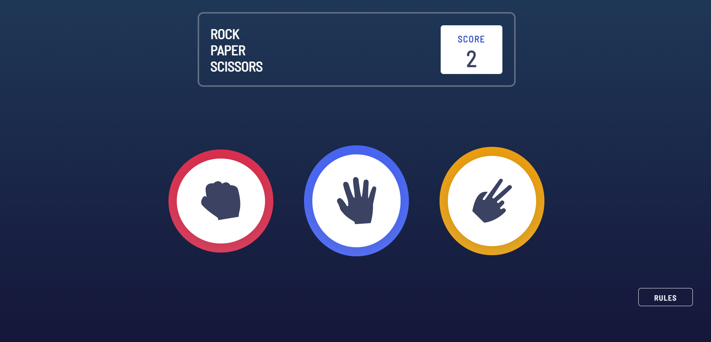

# Frontend Mentor - Rock, Paper, Scissors solution

This is a solution to the [Rock, Paper, Scissors challenge on Frontend Mentor](https://www.frontendmentor.io/challenges/rock-paper-scissors-game-pTgwgvgH). Frontend Mentor challenges help you improve your coding skills by building realistic projects. 

## Table of contents

- [Overview](#overview)
  - [The challenge](#the-challenge)
  - [Screenshot](#screenshot)
  - [Links](#links)
- [My process](#my-process)
  - [Built with](#built-with)
  - [Useful resources](#useful-resources)
- [Author](#author)

## Overview

### The challenge

Users should be able to:

- View the optimal layout for the game depending on their device's screen size
- Play Rock, Paper, Scissors against the computer
- Maintain the state of the score after refreshing the browser _(optional)_
- **Bonus**: Play Rock, Paper, Scissors, Lizard, Spock against the computer _(optional)_

### My Solution Screenshot

### Links

- [Live site here](https://glexan14.github.io/rock-paper-scissors-web/)

## My process

### Built with

- Semantic HTML5 markup
- CSS custom properties
- JavaScript

### Useful resources

- [Font Awesome](https://fontawesome.com/) - I really liked this website to get some icons and will use it going forward.
- [W3Schools](https://www.w3schools.com/) - I'd recommend it to anyone still learning about programming

- [Frontend Mentor](https://www.frontendmentor.io/challenges) - This website is really useful to put your frontend skills to test and practices. It also give you some resources to begin a challenge like this one.

## Author

- Frontend Mentor - [@GleXan14](https://www.frontendmentor.io/profile/GleXan14)

